# Tables

## Question Flow

### 1384 - 1387

#### Overview

#### A. Employment Status
Employment status during the past week

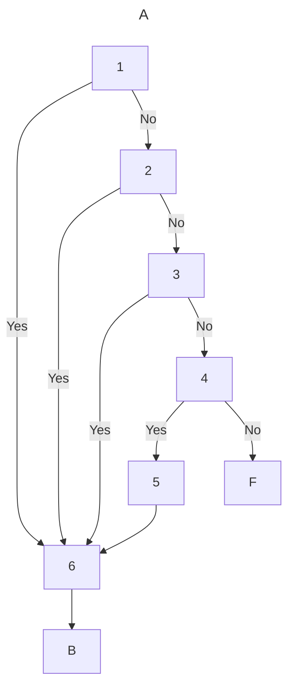

#### B. Main Job

Characteristics of main job

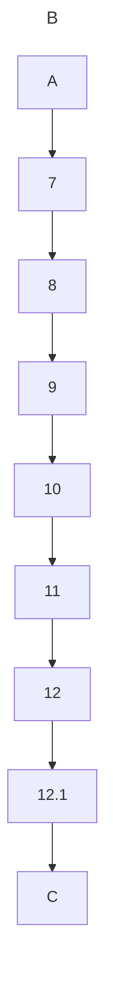

#### C. Work Hours

Hours worked for all jobs

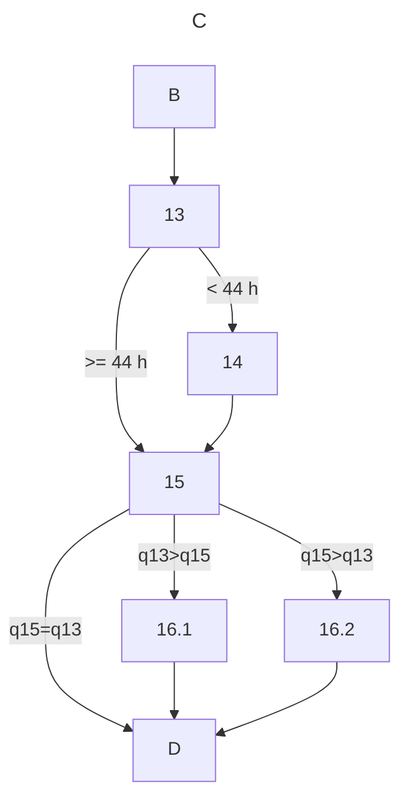

#### D. Increase Work

Willingness to increase hours worked and search for another job

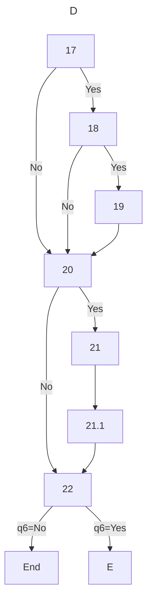

#### E. Second Job

Characteristics of second job

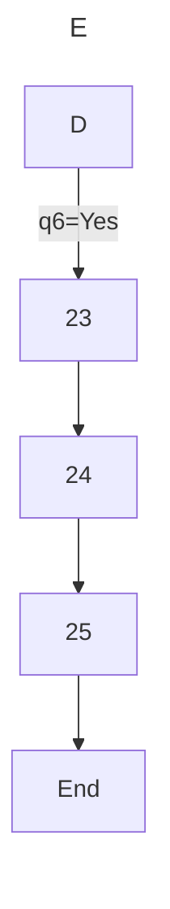

#### F. Previous Work

Previous work experience

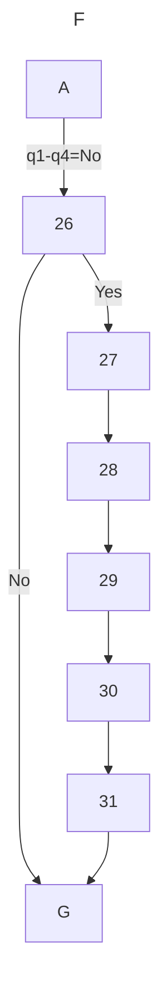

#### G. Job Search

Job search

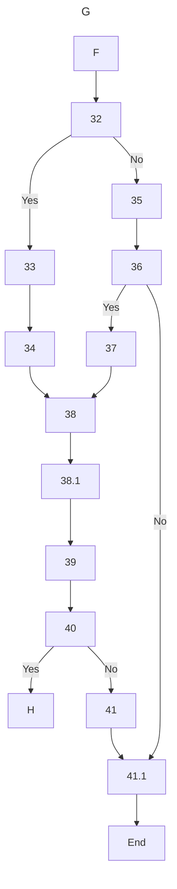

#### H. Desired Job

Characteristics of desired job

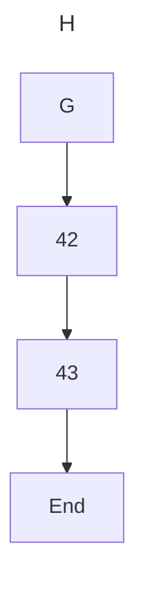

### 1388 - 1401

#### Overview

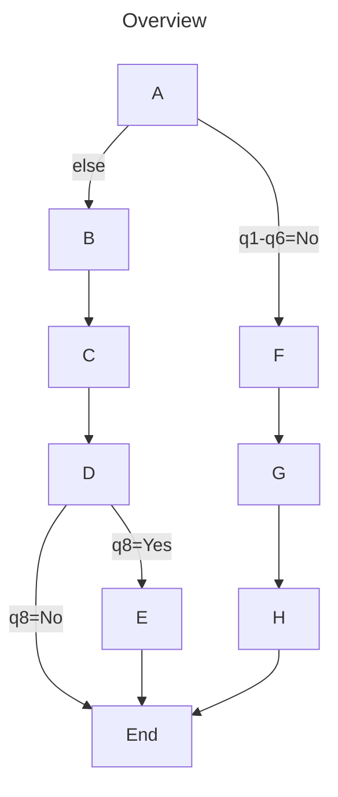

#### A. Employment Status
Employment status during the past week

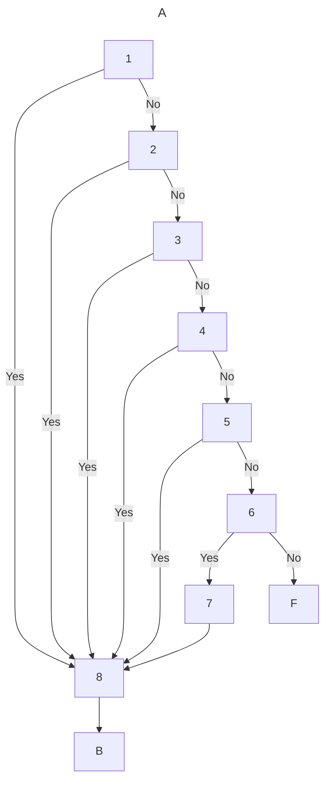

#### B. Main Job

Characteristics of main job

#### C. Work Hours

Hours worked for all jobs

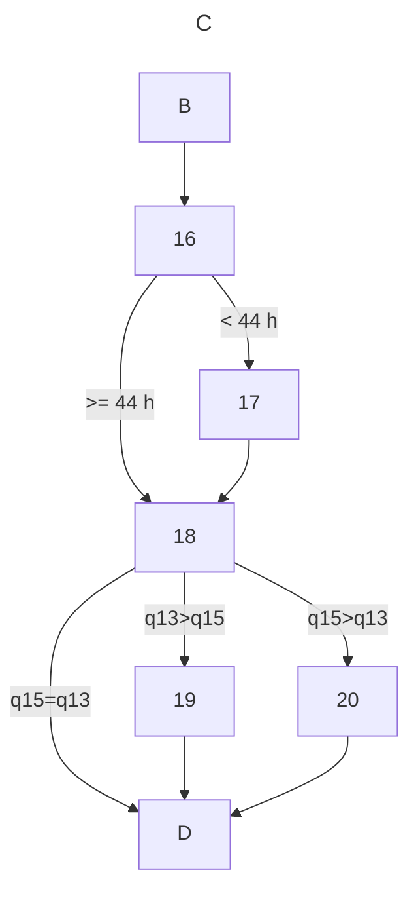

#### D. Increase Work

Willingness to increase hours worked and search for another job

#### E. Second Job

Characteristics of second job

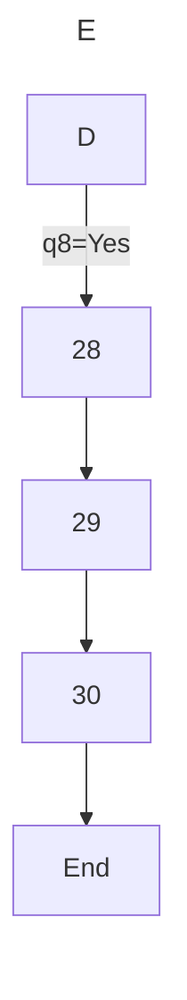

#### F&G. Job Search and Previous Work

Job search and Previous work experience

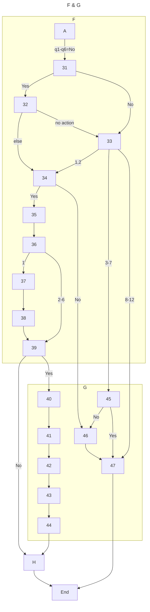

#### H. Desired Job

Characteristics of desired job

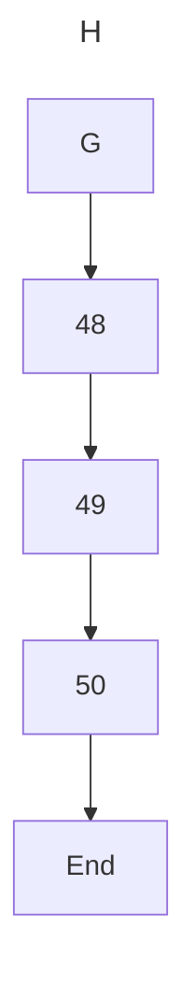
