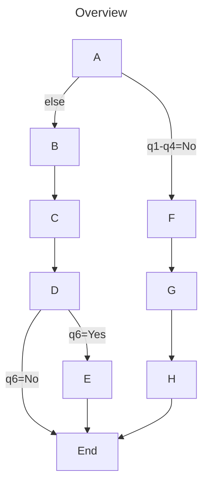
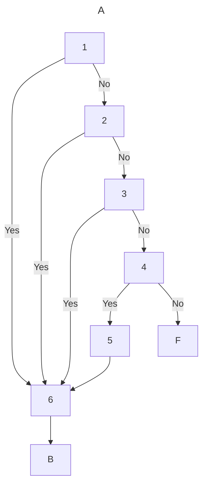
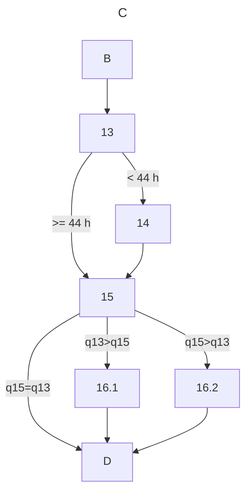
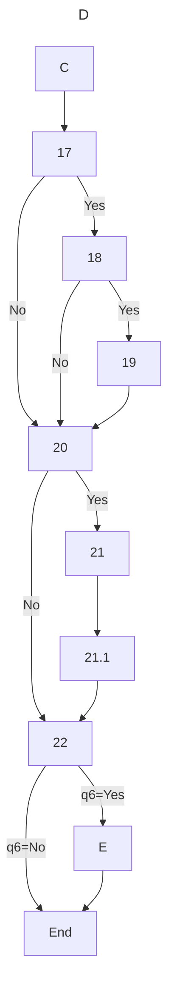
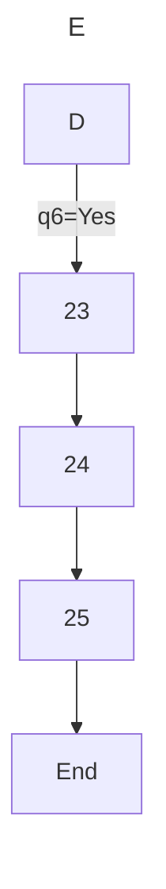
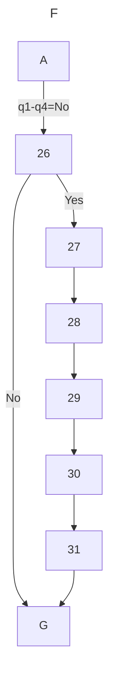
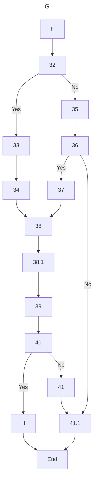
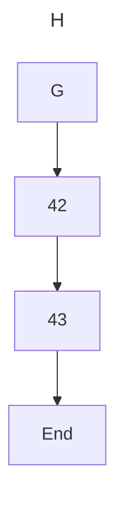

# Form 3 (1384 - 1386)

## Question Flow

### Overview

### A. Employment Status {#a}

Employment status during the past week

### B. Main Job {#b}

Characteristics of main job

### C. Work Hours {#c}

Hours worked for all jobs

### D. Increase Work {#d}

Willingness to increase hours worked and search for another job

### E. Second Job {#e}

Characteristics of second job

### F. Previous Work {#f}

Previous work experience

### G. Job Search {#g}

Job search

### H. Desired Job {#h}

Characteristics of desired job

## Questions

### 1. Worked Last Week {#1}

In the past week, did you work at least one hour to earn wages,
salary, profit or income (cash or in-kind)?

- Yes ➡️ [6](./#6)
- No ➡️ [2](./#2)

### 2. Worked Nonconventional Last Week {#2}

In the past week, did you work for at least one hour to earn income 
through activities such as: 
Agriculture including farming, gardening, livestock, fishing, etc.
Manufacturing or services at home like rug weaving, sewing, 
hairdressing, typing, private tutoring, appliance repair, etc.
Performing military or civil service
Interning at an institution
Studying under scholarship from an organization?

- Yes ➡️ [6](./#6)
- No ➡️ [3](./#3)

### 3. Worked Unpaid Family Business Last Week {#3}
In the past week, did you work for at least one hour without pay in a 
business owned by one of your relatives in the household, in order to 
generate income for the household? (For example, helping the head of 
household with farming, shopkeeping, etc.)

- Yes ➡️ [6](./#6)
- No ➡️ [4](./#4)

### 4. Had Job But Absent Last Week {#4}
Did you have a job that you were temporarily absent from last 
week for certain reasons, and you are sure you will return to?

- Yes ➡️ [5](./#5)
- No ➡️ [26](./#26)

### 5. Reason For Job Absence Last Week {#5}

What was the main reason for your temporary absence from work 
last week?

1. Seasonal work (for self-employed in agriculture like farming, 
    gardening, livestock, fishing, etc)
2. Workplace closed, temporary organizational changes or machine 
    breakdowns
3. No customers or orders
4. Temporary layoff (while still officially employed)
5. Shift work
6. Temporary illness or injury
7. Holidays or leave
8. Education or training
9. Personal or family issues 
10. Adverse weather conditions
11. Other (specify reason)

### 6. Had Other Job Last Week {#6}

Did you have another job last week as well?

- Yes
- No

### 7. Main Job Workplace ISIC Code {#7}

Main characteristics and activity of the main job's workplace
(ISIC code of the main job's workplace)

### 8. Main Job Title ISCO Code {#8}

Main job title and primary duties in the main job
(ISCO code for main job title)

### 9. Main Job Employment Status {#9}

Employment status in main job:

1. Employer
2. Self-employed worker
3. Unpaid family worker
4. Private sector employee 
5. Public sector employee
6. Cooperative sector employee
7. Paid apprentice
8. Unpaid apprentice

### 10. Main Job Workplace Employee Count {#10}

Number of employees at the workplace:

1. 1 to 4 people
2. 5 to 9 people
3. 10 to 19 people
4. 20 to 49 people
5. 50 people or more

### 11. Main Job Has Health Insurance {#11}

Does this job provide you with health insurance coverage?

- Yes
- No

### 12. Main Job Duration {#12}

How many years and months have you been working in this job?

### 12.1 Total Work Experience {#12.1}

In total, how many years and months have you been working?

### 13. Usual Weekly Work Time {#13}

In this season, how many days and hours do you usually work per week?

- _if_:
    1. answer < 44 ➡️ [14](./#14)
    2. answer \>= 44 ➡️ [15](./#15)

### 14. Reason For Usual Work Hours {#14}

Why are your usual weekly work hours ... hours?

1. Nature of work (full-time job less than 44 hours)   
2. Unwillingness to work more
3. Personal or family issues
4. Illness, disability, injury
5. Education or training
6. Unable to find work with more hours
7. Recession or off-season
8. Lack of raw materials or credits
9. Other

### 15. Last Week Work Hours {#15}

Last week, how many total hours did you work in all your jobs? 
(Including overtime but excluding holidays and leave)

- _if_:
    1. 13 answer > 15 answer ➡️ [16.1](./#16.1)
    2. 13 answer < 15 answer ➡️ [16.2](./#16.2)
    3. 13 answer = 15 answer ➡️ [17](./#17)

### 16.1. Reason For Less Work Last Week {#16.1}

Why did you work less than usual last week?

1. Holidays or leave
2. Illness, disability, injury
3. Education or training 
4. Personal or family issues
5. Unable to find more work hours
6. Workplace closed
7. Starting or ending work
8. Recession
9. Other

### 16.2. Reason For More Work Last Week {#16.2}

Why did you work more than usual last week?

1. Unusual overtime
2. Other

### 17. Wanted To Work More Hours Last Week {#17}

Last week, did you want to increase your work hours?

- Yes ➡️ [18](./#18)
- No ➡️ [20](./#20)

### 18. Able To Work More Hours Last Week {#18}

Last week, were you able to work more hours?

- Yes ➡️ [19](./#19)
- No ➡️ [20](./#20)

### 19. Able To Work More Hours Last Week {#19}

How did you want to increase your work hours?

1. Adding hours to current job
2. Finding additional job besides current job
3. Finding new job with more hours instead of current job
4. Combination of above

### 20. Looked For Other Job Last Week {#20}

Last week, were you looking for another job?

- Yes ➡️ [21](./#21)
- No ➡️ [22](./#22)

### 21. Reason For Job Search {#21}

For what purpose were you looking for another job?

1. Increase income
2. Reduce work hours
3. Possibility of losing current job
4. Optimal use of skills
5. Increase work hours
6. Other

### 21.1. Reason For Job Search {#21.1}

How were you looking for another job?

1. In addition to current job
2. To replace current job
3. Both

### 22. Desired Work Days Per Week This Season {#22}

This season, how many days and hours per week would you like to work?

- _if_:
    1. 6 answer = Yes ➡️ [23](./#23)
    2. 6 answer = No ➡️ End

### 23. Second Job Workplace ISIC Code {#23}

Main characteristics and activity of the second job's workplace
(ISIC code of the second job's workplace)

### 24. Second Job Title ISCO Code {#24}

Main job title and primary duties in the second job
(ISCO code for second job title)

### 25. Second Job Employment Status {#25}

Employment status in second job:

1. Employer
2. Self-employed worker
3. Unpaid family worker
4. Private sector employee 
5. Public sector employee
6. Cooperative sector employee
7. Paid apprentice
8. Unpaid apprentice

### 26. Ever Worked Before {#26}

Have you ever worked before?

- Yes ➡️ [27](./#27)
- No ➡️ [32](./#32)

### 27. Time Since Last Job {#27}

How long has it been since you left your last job?

### 28. Last Job Workplace ISIC Code {#28}

Main characteristics and activity of the last job's workplace
(ISIC code of the last job's workplace)

### 29. Last Job Title ISCO Code {#29}

Main job title and primary duties in the last job
(ISCO code for last job title)

### 30. Last Job Employment Status {#30}

Employment status in last job:

1. Employer
2. Self-employed worker
3. Unpaid family worker
4. Private sector employee 
5. Public sector employee
6. Cooperative sector employee
7. Paid apprentice
8. Unpaid apprentice

### 31. Reason For Leaving Last Job {#31}

What was the main reason for leaving your job?

1. Low income
2. Permanent workplace closure
3. Seasonal work
4. Temporary work
5. Workplace relocation
6. Education or training
7. Layoff or downsizing
8. Family issues 
9. Migration
10. Retirement
11. End of military service
12. Other

### 32. Took Action To Search For Job Last 4 Weeks {#32}

In the past 4 weeks (including the reference week), did you take 
specific actions to search for work?

- Yes ➡️ [33](./#33)
- No ➡️ [35](./#35)

### 33. Job Search Method {#33}

In the past 4 weeks, which method did you use to look for work?

- Registering or following up with government employment agencies
- Registering or following up with other employment agencies
- Contacting employers
- Asking friends or acquaintances
- Searching for financial resources and possibilities to start self-employment
- Applying for business license or work permit
- Placing or answering job advertisements
- Other

### 34. Job Search Duration Years {#34}

How long have you been looking for work?

### 35. Reason Not Job Searching Last 4 Weeks {#35}

What is the reason you were not searching for work in the past 4 weeks?

1. Starting work in future (waiting to start new job)
2. Awaiting employer response or job test results 
3. Awaiting other job search efforts to come to fruition
4. Discouraged from job search, lost hope of finding work
5. Awaiting return to previous job
6. Awaiting work season  
7. Unaware of job search methods
8. Illness, temporary disability, pregnancy
9. In education or training
10. Personal or family responsibilities
11. No need to work
12. Other

### 36. Wants To Have Job Or Occupation {#36}

Do you want to have a job or occupation?

- Yes ➡️ [37](./#37)
- No ➡️ [41.1](./#41.1)

### 37. Time Wanting To Work {#37}

How long have you wanted to work?

### 38. Situation Before Wanting To Work {#38}

What was your situation before that?

1. Employed
2. Student
3. Homemaker
4. Retired
5. Had income without work
6. Other

### 38.1 Total Work Duration {#38.1}

In total, how many years and months have you worked?

### 39. Currently Receiving Unemployment Insurance {#39}

Are you currently receiving unemployment insurance?

- Yes
- No

### 40. Ready To Start Job If Found Last Week {#40}

If a job or occupation was found for you last week, would you have 
been ready to start working in it by the end of this week?

- Yes ➡️ [42](./#42)
- No ➡️ [41](./#41)

### 41. Reason Not Ready For Work {#41}

Why were you not ready to start working?

1. Need to complete education or related training
2. Illness, temporary disability
3. Not having suitable age
4. Personal and family responsibilities
5. Other

### 41.1. Situation_Last_Week {#41.1}

What was your situation last week?

1. Employed
2. Student 
3. Homemaker
4. Retired
5. Income without work
6. Other

➡️ End

### 42. Preferred Employment Status {#42}

Which employment status do you prefer?

1. Self-employment
2. Paid employment

### 43. Preferred Work Sector {#43}

In which of the following sectors do you prefer to work?

1. Agriculture
2. Industry 
3. Services

➡️ End
